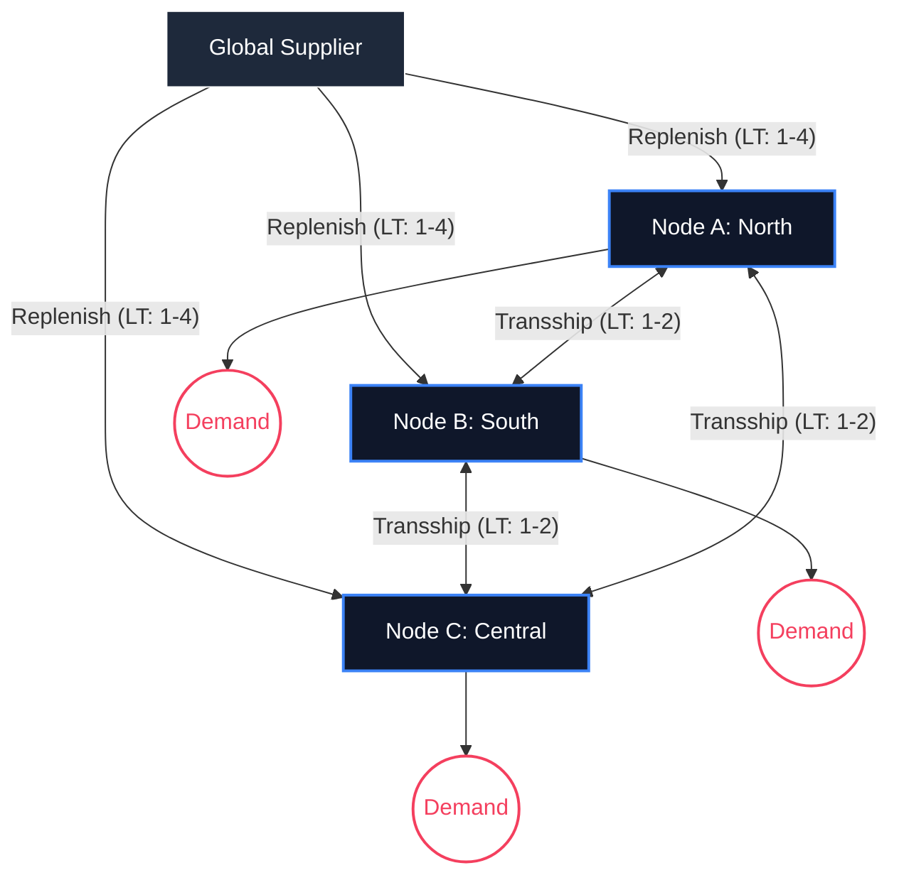

# 📦 InventoryGym-v1: Alpha Elite Edition
**High-Fidelity Multi-Node Supply Chain Intelligence Benchmark for OpenEnv**


InventoryGym-v1 is a professional-grade Reinforcement Learning environment designed for the **Meta OpenEnv Hackathon**. It challenges agents to move beyond simple replenishment and master the complexities of a dynamic, multi-node supply chain network under extreme uncertainty.

---

## 🚀 The "Alpha Elite" Advantage

Unlike standard inventory simulations, the Alpha Elite version introduces critical real-world complexities that demand advanced strategic reasoning:

### 1. 🌐 Network Transshipment (Horizontal Flow)
Agents can optimize inventory not just by ordering from a global supplier, but by **shifting stock between warehouses**. This introduces a 2D action space (Vertical Replenishment + Horizontal Realignment).

### 2. ⚡ Stochastic Lead Times
No more predictable deliveries. Shipments encounter "Probabilistic Friction," with arrival times varying based on environmental noise (Lead Time $\pm$ 2 steps), forcing agents to manage **Safety Stock** scientifically.

### 3. 📉 Systemic Shocks (Black Swan Events)
The environment triggers multi-cycle crises:
- **Demand Shocks**: Sudden $400\%$ spikes in market appetite.
- **Logistics Shocks**: Port strikes and fuel crises that double operational costs and delay standard shipping lanes.

---

## 🧠 Environment Topology



---

## 📊 Strategic Dashboard

The environment features an ultra-premium **Intelligence Alpha Elite** dashboard:
- **Real-time Topology Map**: Visualizes flow vectors and node health.
- **Neural Stream Log**: Real-time telemetry of agent decisions and systemic shocks.
- **Inventory Matrix**: Smoothly animated KPI counters and demand forecast charts.

---

## 🛠️ OpenEnv Compliance

InventoryGym-v1 is fully compliant with the **OpenEnv API** standard for seamless agent evaluation:

- **Async Core**: Implements non-blocking `reset()`, `step()`, and `state()` endpoints.
- **Pydantic Hardened**: Strict schema validation for actions and observations.
- **Deterministic Grader**: Scores are calculated on a composite of Service Level (SL) and Cost Efficiency (CE), clamped to $(0.01 - 0.99)$.

### Action Space
| Command | Format | Description |
| :--- | :--- | :--- |
| **Order** | `order <dest> <qty> [priority]` | Order from global supplier |
| **Transfer** | `transfer <from> <to> <qty> [priority]` | Transship between warehouses |

---

## 🏁 Getting Started

### 1. Install Dependencies
```bash
pip install -r requirements.txt
```

### 2. Launch the Intelligence Hub
```bash
uvicorn app:app --host 0.0.0.0 --port 7860
```

### 3. Run Validation Agent
```bash
python inference.py
```

---

## 🏆 Scoring Logic
Scores are computed using a non-linear decay function:
- **Target SL**: $92\%$ (Easy) → $85\%$ (Hard)
- **Reward Shaping**: Penalizes inventory imbalance and rewards strategic "buffers" during logistics shocks.

---
Built with ❤️ for **Meta OpenEnv Hackathon & Scaler SST Bengaluru Finals**.
