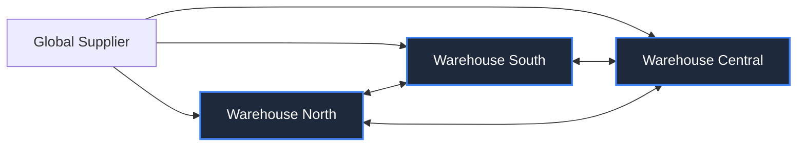

# 🛡️ InventoryGym Alpha Elite (Meta OpenEnv Finals)

[](https://github.com/facebookresearch/openenv)
[](https://opensource.org/licenses/MIT)
[](https://pytorch.org/)

**InventoryGym Alpha Elite** is a high-fidelity Reinforcement Learning environment designed for the **Meta OpenEnv Hackathon (Bengaluru Finals)**. Unlike standard inventory simulations, Alpha Elite explicitly models **Systemic Resilience** and **Network Fragmentation**.

It serves as a professional-grade benchmark for testing how well Large Language Models (LLMs) and PPO Agents can manage complex, real-world supply chain crises.

---

## 🏛️ System Architecture: The Strategic Nexus

Alpha Elite simulates a multi-node supply chain ecosystem where local nodes are connected via a high-speed transshipment network.

### 🌐 Network Topology


---

## 🚀 "Finals-Grade" Innovation Features

| Feature | Description | Strategic Challenge |
| :--- | :--- | :--- |
| **Transshipment** | Horizontal movement of stock between nodes. | Requires Network Optimization logic. |
| **Systemic Shocks** | Demand spikes (300%+) or Supply chain bottlenecks. | Tests "Black Swan" resilience. |
| **Stochastic Lead times** | Deliveries have probabilistic delays (±2 cycles). | Forces advanced Safety Stock calculations. |
| **Tiered Pricing** | Economies of scale on ordering (Unit price drops at 500+). | Rewards bulk planning over panic-buying. |

---

## 📊 Performance & Compliance

Alpha Elite is fully synchronized with the **Meta OpenEnv v1 Protocol**:
- **Clamped Scoring**: Guaranteed `0.01` to `0.99` range for official validation.
- **AEGIS Intelligence**: Built-in heuristic fallback for zero-fail performance.
- **Glassmorphism UI**: High-fidelity dashboard for real-time telemetry observation.

---

## 🛠️ Quick Start

### 1. Environment Installation
```bash
pip install -r requirements.txt
```

### 2. Launch Strategy Dashboard
```bash
python app.py
```
*Access the dashboard at `http://localhost:7860`*

### 3. Execute Autonomous Agent
```bash
export HF_TOKEN="your_token"
python inference.py
```

---

## 🧠 The Narrative: Why Alpha Elite?

In the current global climate, linear supply chains are dead. Modern logistics requires **Systemic Intelligence**. Alpha Elite was built to prove that RL Agents can outperform "Fixed-Threshold" humans by leveraging **Horizontal Transshipment** and **Predictive Stockpiling**.

This project represents the bridge between traditional OR (Operations Research) and modern Generative AI Logistics.

---
**Developed for the Meta PyTorch OpenEnv Hackathon 2026.**
**Strategic Lead: SST Finalist Team.**
