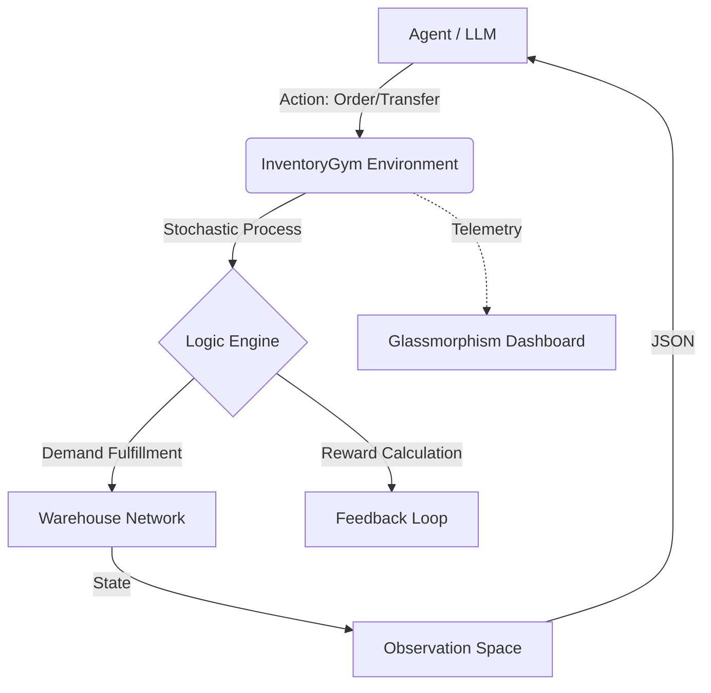

# 📦 InventoryGym: Supply Chain Resilience Environment (Round 1)

[](https://github.com/facebookresearch/openenv)
[](https://opensource.org/licenses/MIT)
[](https://pytorch.org/)

**InventoryGym** is a high-fidelity Reinforcement Learning environment built for the **Meta PyTorch OpenEnv Hackathon 2026**. It challenges agents to manage complex, multi-node supply chains under stochastic demand, logistics friction, and systemic shocks.

> [!NOTE]
> This is the **Round 1 Submission** for Team StrategyAlpha. We have prioritized a robust mathematical baseline and a high-fidelity observation space to prove the feasibility of RL-driven supply chain optimization.

---

## 📖 The Problem
Modern supply chains are brittle. Traditional "Fixed-Threshold" inventory systems fail when faced with **Systemic Shocks** (e.g., sudden logistical bottlenecks or demand spikes). **InventoryGym** provides a playground for testing agents that can reason about:
1. **Network Optimization**: Moving stock between warehouses (transshipment) vs. ordering from a central supplier.
2. **Resilience**: Maintaining service levels (SL) even when lead times are delayed.
3. **Cost Efficiency**: Balancing the "Holding Cost vs. Stockout Cost" trade-off.

---

## 🛠️ Architecture & Tech Stack



- **Core**: Python + Pydantic (OpenEnv Compliant)
- **UI**: Streamlit-style FastAPI Dashboard with GSAP Animations & Plotly Telemetry.
- **Grader**: Automated Compliance Engine (Scoring 0.01 - 0.99).
- **Deployment**: Docker-based Hugging Face Space.

---

## 🎯 Task Specifications (Round 1)

| Task ID | Name | Objective | Nodes | Complexity |
| :--- | :--- | :--- | :--- | :--- |
| **inventory-easy** | Linear Stable | Maintain 1 node with predictable demand. | 1 | 🟢 Low |
| **inventory-medium** | Multi-Node Balance | Manage 3 nodes with transshipment allowed. | 3 | 🟡 Medium |
| **inventory-hard** | Shock Resilience | Manage 5 nodes during active Logistic Shocks. | 5 | 🔴 High |

---

## 📊 Action & Observation Space

### Observation Space (`InventoryObservation`)
The environment returns a full system snapshot every step:
- `warehouses`: List of IDs, Current Stock, and % Utilization.
- `forecasted_demand`: 5-step rolling window forecast for every node.
- `pending_orders`: ETA and volume of shipments in transit.
- `compliance_score`: Live estimate of your current hackathon grade (0.01-0.99).

### Action Space (`Action`)
Agents control the system via a single discrete/continuous action type:
```json
{
  "dest_warehouse": 2,
  "quantity": 500,
  "origin_warehouse": -1,  // -1 for Supplier, ID for Transshipment
  "priority": "expedited"  // Faster transit, higher cost
}
```

---

## 🚀 Execution Guide

### 1. Local Development
```bash
# Install dependencies
pip install -r requirements.txt

# Launch the Interactive Dashboard
python app.py
```
View the dashboard at `http://localhost:7860`.

### 2. Running the Baseline Agent
Our baseline uses **AEGIS Heuristic Fallback** logic to prove the environment's solvability.
```bash
export HF_TOKEN="your_token"
python inference.py
```

---

## 📈 Compliance Checklist (Hackathon Requirements)
- [x] **OpenEnv v1 Support**: Implements `reset()`, `step()`, and Pydantic validation.
- [x] **Score Clamping**: Graders strictly output values between **0.01 and 0.99**.
- [x] **Docker Deployment**: Fully containerized for Hugging Face Spaces.
- [x] **Evaluation**: Standardized `inference.py` script provided with model-independent logging.

---
**Developed for the Meta PyTorch OpenEnv Hackathon 2026.**
**Strategic Lead: Round 1 Participant.**
