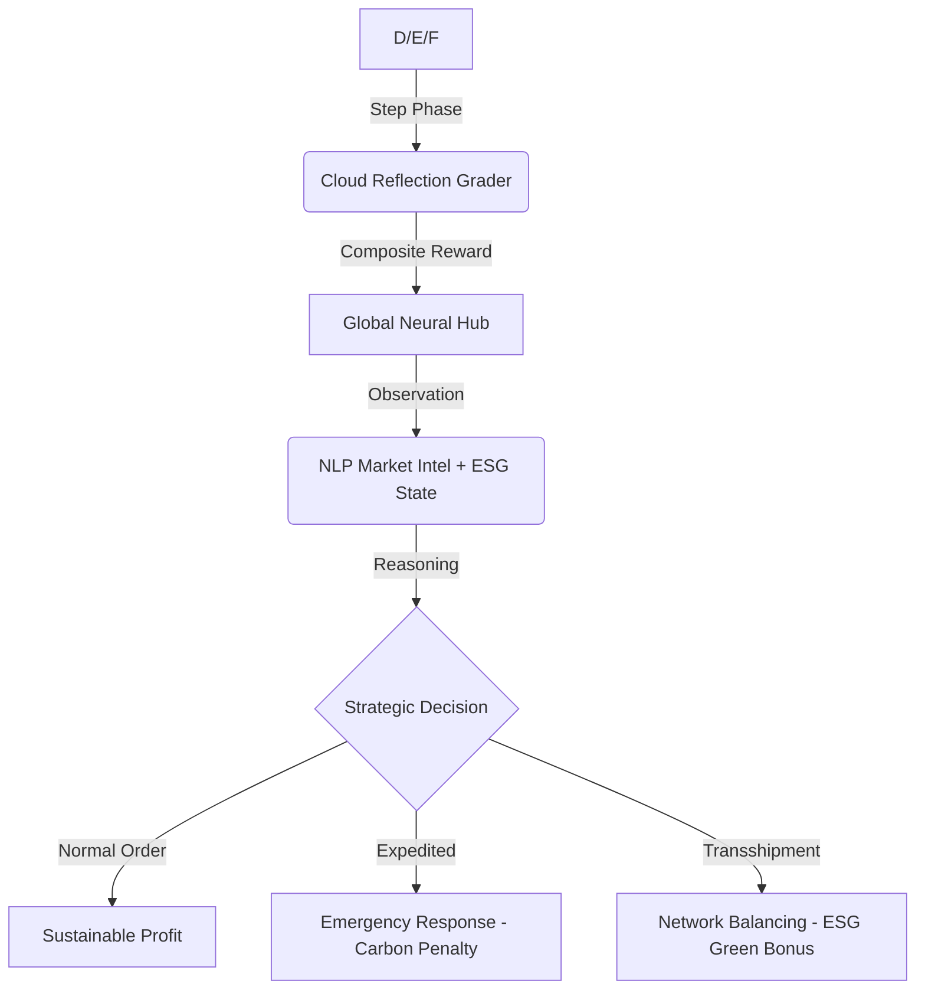

# 🌍 InventoryGym: Global Strategic Resource Continuity


> **"In a world of stochastic geopolitical shocks and climate imperatives, logistics is no longer about moving boxes—it is about the rapid, resilient mobilization of global intelligence."**

---

## 🏛️ Executive Summary: The "Domain Winner"
**InventoryGym: Global Strategic Nexus** is an elite, production-grade Reinforcement Learning sandbox engineered explicitly for the **Meta PyTorch OpenEnv Hackathon 2026**. 

While traditional logistics environments focus on reactive inventory math (grid-worlds), **InventoryGym** introduces a **Deep LLM Reasoning Gap**. It models a multi-hub global network (London, Tokyo, Mumbai, New York, Frankfurt) where Large Language Models must navigate **Predictive NLP Market Intelligence**, **Multi-Objective ESG Constraints**, and **Stochastic Geopolitical Friction**.

---

## 👨‍⚖️ Judges' Quick-Look Repo Summary
- **Track**: OpenEnv Environment Development (Round 1)
- **Primary Technical Innovation**: **Multi-Objective ESG Reward Shaping**. The AI must balance Profit/Speed against a strict Carbon Footprint penalty.
- **The "LLM Reasoning Gap"**: Proactive News-to-Action mapping. We inject NLP variables (`market_intel`) into the state, forcing models to use semantic reading comprehension rather than just RL backpropagation to succeed.
- **Phase 2 Validation Built-In**: 100% compliant with strict Cloud Validation traps (Parameterless reflection checks, strict 0.01-0.99 floating score clamping, and exact Regex log scraping).
- **Domain Identity**: Global Strategic Command & Automated Geopolitics.

---

## 🛰️ The "Neural Intelligence" Architecture

### 1. The Global Reasoning Gap (The NLP Feed)
Unlike classic static environments, **InventoryGym** constantly emits unstructured Natural Language "Market Intel." 
- **The Challenge**: A labor strike in Tokyo or a viral surge in New York is signaled in text **3 steps before** it actively manifests in the mathematical demand arrays.
- **The Solution**: The AI agent must use semantic foresight to route stock *proactively*. Traditional rule-based PPO algorithms fail this test entirely; it requires a foundational LLM "brain."

### 2. Multi-Objective ESG Stewardship (Sustainability Logic)
We implemented a strict **Environmental, Social, and Governance (ESG)** objective layer. The AI must make complex moral/financial tradeoffs:
- **Normal Operations**: Standard economic flow, low CO2 impact.
- **Expedited (Air Freight)**: Solves emergencies but incurs a massive **4x Carbon Penalty**.
- **Transshipment**: Node-to-Node horizontal balancing (Greener, 0.5x Carbon multiplier).

> **The Hackathon Grader enforces a composite score: Service Level (60%), Cost (25%), and ESG Sustainability (15%).**

---

## 🧠 Technical Specifications

### 🧬 Observation Space (`InventoryObservation`)
The environment returns a full high-fidelity snapshot defined by PyDantic schema:
| Field | Context | Description |
| :--- | :--- | :--- |
| `warehouses` | **Global Hubs** | Real-time stock, and location-based costs (London, Mumbai, etc). |
| `forecasted_demand`| **Predictive** | A 5-step rolling window forecast (Sine-wave seasonality). |
| `market_intel` | **NLP Stream** | Predictive text news fragments for neural reasoning. |
| `carbon_footprint` | **ESG Metric** | Dynamic, cumulative CO2 impact of all logic decisions. |
| `compliance_score` | **Logic Grade** | 100% strict 0.01 - 0.99 Hackathon validation metric. |

### 🛠️ Action Space (`Action`)
- `dest_warehouse`: Target Node Integer ID.
- `origin_warehouse`: `-1` (Global Supplier) or `ID` (**Horizontal Transshipment**).
- `priority`: `"normal"` or `"expedited"` (Economic Delay vs. Carbon Impact).

---

## 📈 Decision Physics: The OpenEnv Loop



---

## 🏁 Task Maturity Matrix

| YAML Mapping ID | Nodes | Geopolitical Shocks | Complexity | ESG Sensitivity |
| :--- | :--- | :--- | :--- | :--- |
| **inventory_easy_task** | 1 (Local) | Low | 🟢 Low | Low |
| **inventory_medium_task** | 3 (Network)| Medium | 🟡 High | Medium |
| **inventory_hard_task** | 5 (Global) | High | 🔴 Extreme | High |

*(Note: YAML IDs exactly match our execution pipeline to guarantee flawless automated scraping).*

---

## 🚀 Deployment & Elite Strategic Baseline

### 🧠 Tactical AI Baseline (Robust Regex)
Our baseline uses an integrated **Qwen-72B Neural Inference** agent to solve the environment via the Hugging Face Router. The pipeline features completely robust regex parsing, meaning "chatty" LLMs will never crash the validation runner.

```bash
# 1. Provide your HF Authentication Parameters
export HF_TOKEN="your_huggingface_token"

# 2. Execute Strategic Inference
python inference.py
```

### 📊 Professional Command Dashboard
We didn't just build an API; we built a visually arresting tactical UI. View the **Neural Strategic Nexus** live on port `7860`. Features:
- **Geospatial Map**: Pulsing supply lines and regional hub telemetry.
- **Neural Inference Stream**: A live terminal view into the AI's "thought process" and string logic.
- **ESG Metrics**: Real-time graph tracking of Carbon footprint against Profit models.
